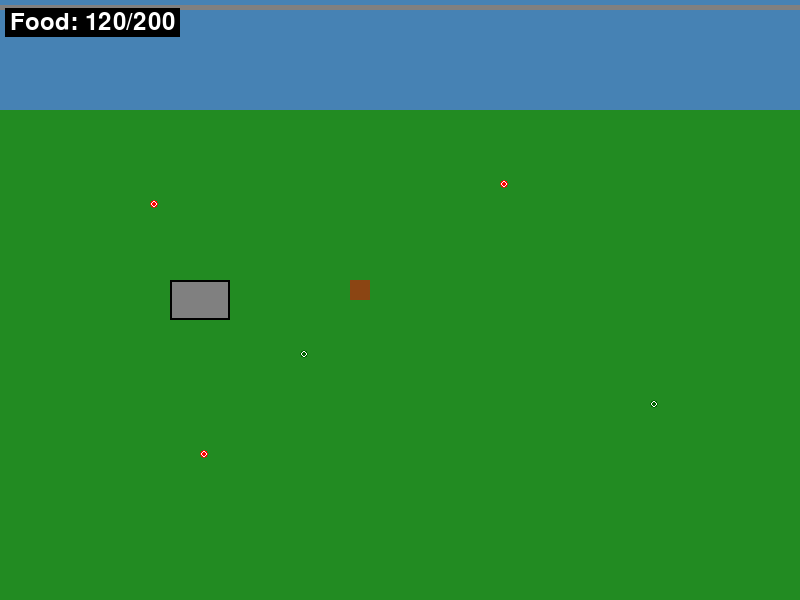

# Beaver Survival Game - MVP Version

A 2D top-down survival game where you play as a beaver collecting food to survive in your woodland home.

## Quick Start

```bash
# Install dependencies
pip install -r requirements.txt

# Run the game
python main.py
```

## How to Play

### Objective
Survive as long as possible by collecting food while avoiding starvation.

### Controls
- **Movement**: WASD keys or Arrow keys
- **Bite Action**: SPACE bar
- **Pause**: ESC key
- **Restart** (after game over): R key
- **Quit** (from pause menu): Q key

### Game Mechanics

#### Food System
- **Starting Food**: 120 units
- **Maximum Capacity**: 200 units
- **Food Consumption**: Decreases by 1 unit every 4 seconds
- **Food Collection**: Each food item adds 5 units
- **Game Over**: When food reaches 0

#### Game World
- **Lodge**: Brown/gray rectangle - your safe home
- **Dam**: Blue/gray barrier along the north border
- **Water Zone**: Blue area with normal movement speed
- **Land Zone**: Green area with slower movement speed

#### Food Items
- **Berries**: Red circles
- **Leaves**: Dark green circles
- **Spawning**: New food appears every 10-15 seconds
- **Collection**: Walk over food items to collect them

### Game States
- **Playing**: Normal gameplay
- **Paused**: Game frozen, access to resume/quit menu
- **Game Over**: Shows survival time and restart option

### UI Elements
- **Food Counter**: Upper-left corner shows "Food: X/200"
- **Warning**: Food counter turns red when below 20% capacity

## MVP Features Implemented

✅ **Core Gameplay**
- 800x600 pixel game window running at 60 FPS
- HOME_SCREEN with Lodge and Dam
- Beaver character (20x20 brown rectangle) with smooth movement
- Food collection and consumption system
- Game over detection with survival time tracking

✅ **Controls & Input**
- WASD and Arrow key movement
- SPACE for bite action
- ESC for pause menu
- R for restart functionality

✅ **Game Objects**
- Lodge (safe zone, 60x40 pixels)
- Dam (blocks north border, 800x10 pixels)
- Food items (8x8 colored circles)
- Automatic food spawning system

✅ **User Interface**
- Real-time food counter display
- Pause menu with Resume/Quit options
- Game over screen with survival time
- Color-coded food warning system

✅ **Game States**
- Playing state with full gameplay
- Paused state with menu overlay
- Game over state with restart capability

## Technical Details

### File Structure
```
main.py           # Main game loop and initialization
player.py         # Beaver character logic
game_objects.py   # Lodge, Dam, and Food items
game_state.py     # Game state management
ui.py            # User interface elements
utils.py         # Constants and utility functions
```

### Dependencies
- pygame >= 2.5.0
- Python 3.12+

### Performance
- Target: 60 FPS
- Resolution: 800x600 pixels
- Memory efficient object management
- Optimized collision detection

## Development Notes

This is the MVP (Minimum Viable Product) version focusing on core gameplay mechanics. The game uses simple colored shapes for rapid prototyping and gameplay validation.

### Future Enhancements (Post-MVP)
- Sprite graphics and animations
- Sound effects and background music
- Multiple screen exploration
- Enhanced beaver behaviors
- Weather and day/night cycles
- Achievement system

## Screenshots



*Screenshot showing the beaver (brown square), lodge (gray rectangle), dam (blue bar), and various food items (colored circles) scattered around the woodland environment.*

---

**Enjoy your woodland adventure! 🦫🌲**