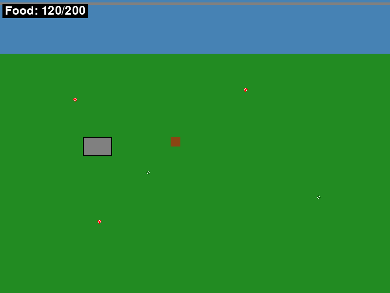

# Newgame - Beaver Survival Game

A 2D top-down survival game where you play as a beaver collecting food to survive in your woodland home. Built with Pygame and inspired by classic adventure games like Zelda: Link to the Past.



## Quick Start

```bash
# Clone the repository
git clone https://github.com/friendlyman23/newgame.git
cd newgame

# Install dependencies
pip install -r requirements.txt

# Run the game (development mode)
python scripts/run_game.py

# Or install as package and run
pip install -e .
newgame
```

## Game Documentation

- 📖 [Game Documentation](docs/GAME_README.md) - How to play, controls, and mechanics
- 🎯 [Design Document](docs/design_doc.md) - Game design and implementation details
- 📸 [Screenshots](docs/screenshots/) - Game screenshots and visual examples
- 🤝 [Contributing Guide](CONTRIBUTING.md) - How to contribute to the project

## Development

### Modern Project Structure

The project has been reorganized to follow Python best practices for game development:

```
newgame/
├── src/newgame/           # Main game package
│   ├── config/            # Game settings and constants
│   │   ├── settings.py    # Configurable game parameters
│   │   └── constants.py   # Static game constants
│   ├── core/              # Core game systems
│   │   ├── game.py        # Main game class and loop
│   │   └── game_state.py  # Game state management
│   ├── entities/          # Game objects
│   │   ├── player.py      # Player (beaver) character
│   │   ├── objects.py     # Lodge, dam, and other objects
│   │   └── food.py        # Food system and items
│   ├── systems/           # Game systems
│   │   └── ui.py          # User interface and HUD
│   └── utils/             # Utility functions
│       └── math.py        # Math and collision utilities
├── tests/                 # Test suite
├── docs/                  # Documentation and screenshots
├── scripts/               # Development scripts
└── examples/              # Example code and demos
```

### Development Environment Setup

#### Automated Setup (Recommended)

**On macOS/Linux:**
```bash
./setup_env.sh
```

**On Windows:**
```cmd
setup_env.bat
```

#### Manual Setup

```bash
# Create virtual environment
python -m venv venv

# Activate environment
source venv/bin/activate  # macOS/Linux
# or
venv\Scripts\activate     # Windows

# Install dependencies
pip install -r requirements.txt
```

### Running the Game

Several ways to run the game:

```bash
# Development mode (recommended during development)
python scripts/run_game.py

# Direct module execution
python -m newgame.main

# Installed package (after pip install -e .)
newgame
```

### Testing

```bash
# Install development dependencies
pip install -e .[dev]

# Run tests
pytest

# Run with coverage
pytest --cov=newgame --cov-report=html
```

### Build Validation

Before making changes, verify your environment is working correctly:

```bash
# Quick smoke test - validates all imports and basic functionality
python scripts/validate_build.py

# Should show: "🎉 Build validation PASSED!"
```

**Why use build validation?**
- Catches "works on my machine" issues early
- Verifies pygame installation and initialization
- Tests all core game module imports
- Validates basic object instantiation
- Runs in ~5 seconds

**When to run:**
- Before starting development work
- After environment changes
- When debugging import/dependency issues
- Before committing changes

### Code Quality

```bash
# Format code
black src/ tests/

# Check style
flake8 src/ tests/
```

### Debugging

The game supports Python debugging using debugpy for VS Code and other IDEs:

#### Enable Debugging Mode

```bash
# Set environment variable to enable debugpy
export DEBUGPY_ENABLE=1  # Linux/macOS
# or
set DEBUGPY_ENABLE=1     # Windows

# Run the game - it will wait for debugger attach
python -m newgame.main
```

When debugging is enabled, the game will:
1. Start debugpy server on port 5678
2. Print "Waiting for debugger attach..."
3. Wait for a debugger to connect before continuing

#### VS Code Debugging

Two pre-configured launch configurations are available in `.vscode/launch.json`:

1. **"Python: Attach to Newgame Debugger"** - Attach to a running game instance
2. **"Python: Launch Newgame with Debugger"** - Launch game with debugging enabled

To use:
1. Start the game with `DEBUGPY_ENABLE=1`
2. In VS Code, go to Run and Debug (Ctrl+Shift+D)
3. Select "Python: Attach to Newgame Debugger"
4. Click the play button to attach

#### Remote Debugging

The debugpy server listens on `0.0.0.0:5678`, allowing remote debugging:

```bash
# From your IDE or debugger client
import debugpy
debugpy.connect(("remote-host", 5678))
```

## Requirements

- **Python**: 3.8+ (3.12.3 recommended)
- **Pygame**: 2.5.0+
- **Development Tools**: pytest, black, flake8 (for contributors)

## Key Improvements in New Structure

1. **Proper Python Package**: Installable package under `src/newgame/`
2. **Separation of Concerns**: Clear separation between config, core systems, entities, and utilities
3. **Scalability**: Easy to add new systems (audio, graphics, networking) later
4. **Testing**: Dedicated test structure with room to grow
5. **Modern Configuration**: Uses `pyproject.toml` for modern Python project standards
6. **Documentation**: Centralized docs with organized screenshots

## License

This project is currently in development. License information will be added as the project progresses.